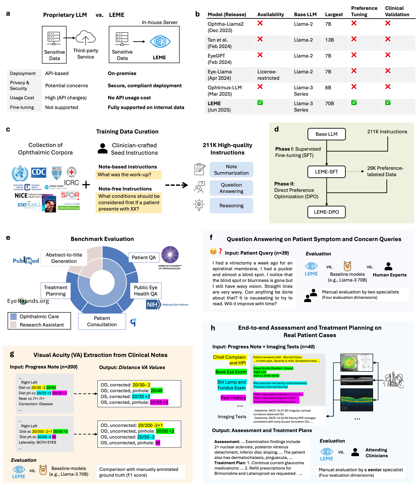
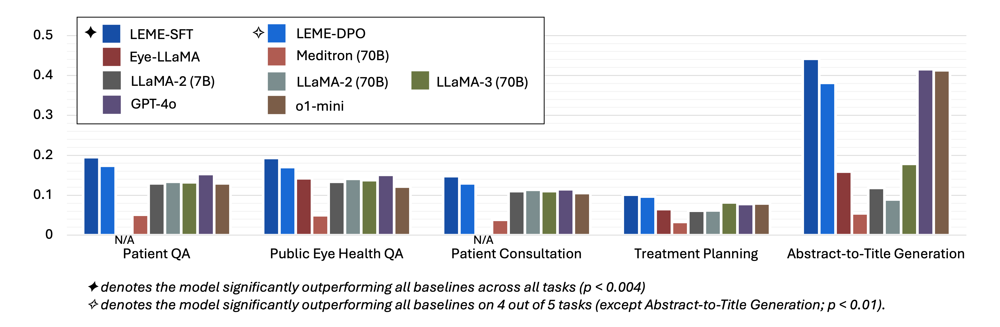

# LEME :globe_with_meridians: — Open Large Language Models for Ophthalmology with Advanced Reasoning and Clinical Validation

> **Figure 1. Overview of study design.**  
> a, LEME enables secure, on-premise deployment, addressing privacy and customization limitations of proprietary LLMs. b, Compared to prior models, LEME is open-weight, preference-tuned, and clinically validated. c, Training data comprises 211K instructions derived from ophthalmology corpora and clinician-authored instructions. d, Two-stage training: supervised fine-tuning (SFT) followed by direct preference optimization (DPO). e, Evaluation covers five ophthalmology-specific benchmarks, including four clinically relevant tasks and one research assistant task. f-h, Downstream validation includes real patient data and manual specialist review.

## Overview
The global burden of eye disease is rising, creating demand for scalable tools that reduce documentation workload and support clinical decision-making. Existing ophthalmology-focused LLMs are not open-weight and seldom validated beyond knowledge-based QA.

**LEME** is the first open-weight LLM family for ophthalmology that:

* **Runs on-premise** — No third-party API, compliant with sensitive EHR data.  
* **Learns via a two-stage pipeline**  
  1. Supervised Fine-Tuning (SFT) using over 200 K clinician-oriented instructions from guidelines, textbooks, and case reports.  
  2. Direct Preference Optimization (DPO) from nearly 30 K preference-labeled samples to maximize factuality, specificity, completeness, and safety.  
* **Is rigorously benchmarked** on five curated ophthalmology tasks (patient QA, public eye-health QA, patient consultation, treatment planning, and abstract-to-title generation) and three downstream applications (patient query answering, visual-acuity extraction, assessment and treatment planning).  
* **Outperforms seven baselines** (incl. GPT-4o) on all benchmarks (average ROUGE-L +3.32 pp) and receives top specialist ratings (factuality 4.67, completeness 4.79, safety 4.88) on patient query answering.

## Quick Start
We'll release the updated code on GitHub soon!

## Benchmarks & Results

| # | Benchmark (open-ended) | Data Size | What It Measures | Key Take-away |
|---|-----------------------|-----------|------------------|---------------|
| 1 | **Patient QA** | 76 Q-A pairs (AAO) | Accuracy & completeness on real patient questions answered by board-certified ophthalmologists | LEME-SFT & DPO surpass baselines; best ROUGE-L 0.1953, BERTScore 0.8716. |
| 2 | **Public Eye Health QA** | 281 Q-A pairs (NIH NEI) | Ability to deliver lay-friendly medical info | LEME-SFT & DPO surpass baselines; best ROUGE-L 0.1935, BERTScore 0.8480. |
| 3 | **Patient Consultation** | 303 queries (iCliniq) | Robustness to informal patient questions | LEME-SFT & DPO surpass baselines; best ROUGE-L 0.1478, BERTScore 0.8661. |
| 4 | **Treatment Planning** | 245 cases (EyeRounds) | Generating concise management plans from clinical cases | LEME-SFT & DPO surpass baselines; best ROUGE-L 0.1017, BERTScore 0.8229. |
| 5 | **Abstract-to-Title Generation** | 500 research abstracts (PubMed) | Summarisation & research-assistant capability | LEME-SFT hits ROUGE-L 0.4416 (best) and BERTScore 0.8898. |

**Overall performance**

*Average across the five tasks (ROUGE-L / BERTScore)*  
- **LEME-SFT 70B:** **0.2160 / 0.8601**  
- **LEME-DPO 70B:** 0.1905 / 0.8512  
- Best publicly available baseline (LLaMA-3 70B): 0.1281 / 0.8354  
- Best proprietary baseline (GPT-4o): 0.1828 / 0.8422  

> LEME models rank **1st or 2nd on average**, demonstrating state-of-the-art performance in ophthalmology-specific reasoning, patient education, and research assistance while remaining fully open-weight and deployable on-premise.

## License
The license will be updated soon.

## Citation

If you find our work useful, please cite:

@article{kim2024leme,
  title={LEME: Open Large Language Models for Ophthalmology with Advanced Reasoning and Clinical Validation},
  author={Kim, Hyunjae and Ai, Xuguang and Srinivasan, Sahana and Gilson, Aidan and Singer, Maxwell B and Pushpanathan, Krithi and Xie, Qianqian and Park, Jungwoo and Applebaum, Serina and Dawei Yang, Gabriel and others},
  journal={arXiv e-prints},
  pages={arXiv--2410},
  year={2024}
}
